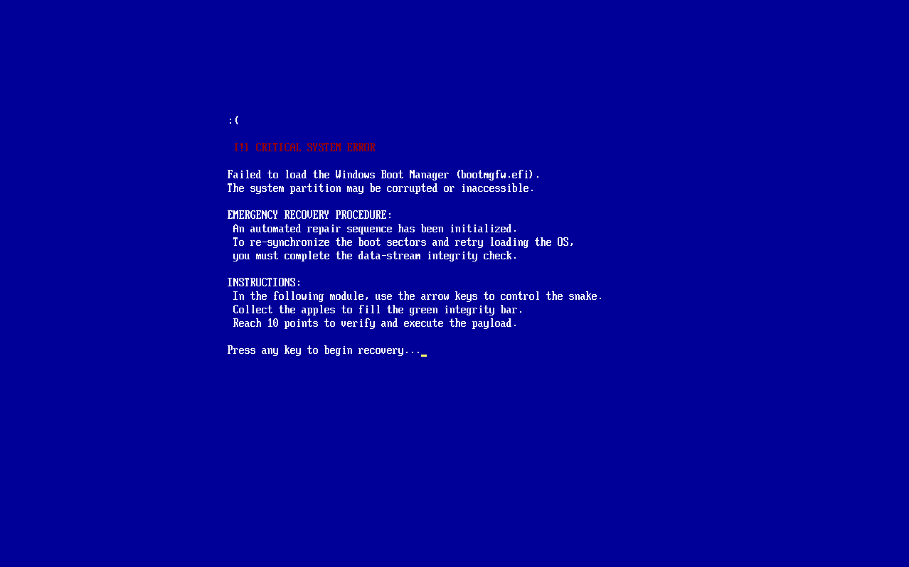
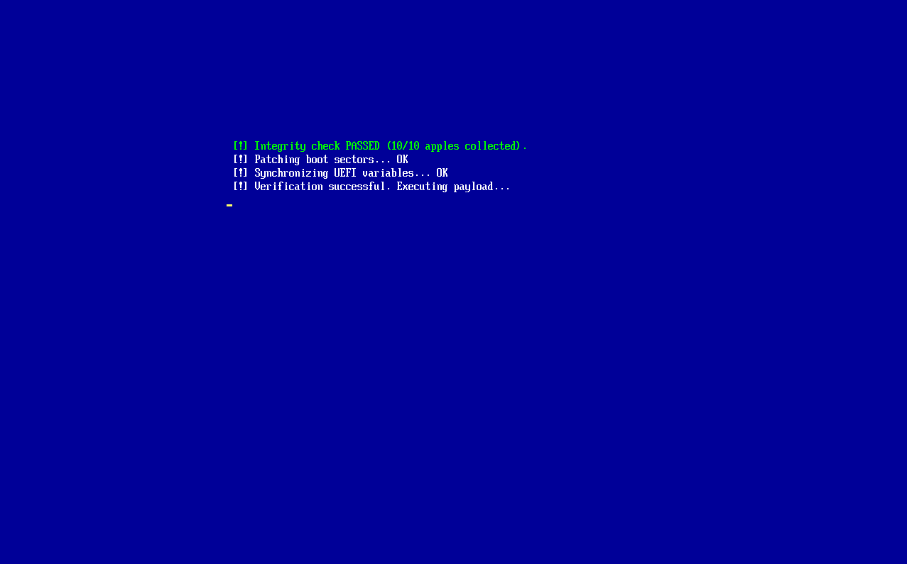

# 🐍 UEFI "Snake-Gate" Bootkit: A Pre-Boot Hijacking PoC

This project is a functional **UEFI Bootkit Proof-of-Concept** that intercepts the Windows boot sequence. It demonstrates how a system's chain of trust can be compromised when **Secure Boot** is disabled, forcing the user to complete a "system repair" (Snake game) before the OS is allowed to load.

## 💀 The Concept: "Gamified" Boot Hijacking

This project simulates a firmware-level "virus" (Bootkit) that targets the **EFI System Partition (ESP)**. Unlike standard malware, it operates before the Operating System even starts, making it invisible to traditional antivirus software.

### The Attack Flow:
1.  **Infection (File-Level Hijacking):** The `installer.efi` replaces the legitimate Windows Boot Manager (`bootmgfw.efi`) with our custom payload. The original Windows loader is renamed to `bootmgfw_ms.efi` to maintain persistence.
2.  **The Interception (Execution Hook):** Upon the next reboot, the motherboard executes our payload. The user sees a fake "Critical System Error" screen (BSOD style).
3.  **Mandatory Recovery (The Payload):** The system access is "locked." To unlock the boot process, the user must manually guide a "Data-Stream Collector" (Snake) to verify system integrity.
4.  **Chainloading (The Handoff):** Once the user collects 10 data fragments (apples), the bootkit reads the original Windows loader from the disk into RAM and executes it using `BS->LoadImage` and `BS->StartImage`.


## 🛠️ Technical Implementation

* **Language:** C.
* **Framework:** Built using the [POSIX-UEFI library](https://gitlab.com/bztsrc/posix-uefi) by bzt.
* **Method:** **File-Level Hijacking** of the `bootmgfw.efi` path on the ESP.
* **Memory Management:** Uses `AllocatePool` and `fread` to load the original OS loader into a memory buffer to bypass `DevicePath` complexity and firmware-specific bugs.
* **Graphics:** Uses the **Graphics Output Protocol (GOP)** for the Snake module and ANSI escape sequences for the custom error screen.

## 📸 Screenshots

### 1. The Hijack (Fake Error)
*The user thinks their system is broken. In reality, our bootkit is in full control.*


### 2. The Mandatory "Repair" (Snake Payload)
*The user must win the game to regain access to their OS.*


### 3. Payload Execution (Success)
*Success screen appearing just before the real Windows starts.*


## 🚀 Build & Simulation Guide

The `Makefile` is configured to handle both real-hardware deployment and QEMU emulation.

### 1. Building for Real Hardware (Pendrive)
If you want to prepare the files for a physical machine:
* **Command:** ```bash
    make all
    ```
* **Result:** This compiles all source code and generates the final binaries, including `installer.efi`. You can then manually copy these files to a FAT32-formatted USB drive to test the hijack on a real system (with Secure Boot disabled).

### 2. Automated Simulation (QEMU)
If you want to test the project in a safe, virtualized environment:
* **Command:** ```bash
    make run
    ```
* **Result:** This command is all-in-one. It compiles the code (if not already built), creates a virtual disk image (`esp.img`) formatted as FAT32, and launches the **QEMU emulator** with OVMF firmware automatically.

### 3. The Hijack Protocol (In Shell)
Once the UEFI Shell appears in QEMU:
1.  **Mount the drive:** Type `FS0:` to enter the simulated EFI partition.
2.  **Infect the system:** Run `installer.efi` to perform the **Boot Hijacking**. This renames the original loader and installs the Snake-Gate.
3.  **Trigger the Payload:** To see the exploit in action, simply reboot or manually execute the hijacked path:
    `\EFI\Microsoft\Boot\bootmgfw.efi`
    

## ⚠️ Security Warning & Disclaimer

**This project is for educational and research purposes only.**

This "attack" is only possible because the bootloader is not being verified. 
* **Secure Boot:** If enabled, the UEFI firmware would check the digital signature of our payload. Since it's not signed by a trusted authority (like Microsoft), the system would refuse to execute it.
* **The Lesson:** This PoC highlights why you should always keep **Secure Boot ON** and use a **BIOS/UEFI Password** to prevent unauthorized Boot Hijacking.

## 📜 Credits
* **Framework:** [POSIX-UEFI](https://gitlab.com/bztsrc/posix-uefi)
* **Developer:** [pomiano](https://github.com/pomiano)
